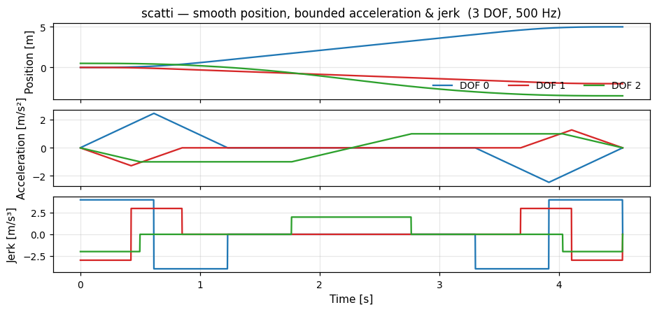

# scatti

<p align="center">
  <a href="https://github.com/mika4128/cruckig/actions/workflows/build-deb.yml">
    
  </a>
  <a href="https://github.com/mika4128/cruckig/issues">
    
  </a>
  <a href="https://github.com/mika4128/cruckig/releases">
    
  </a>
  <a href="https://github.com/mika4128/cruckig/blob/main/LICENSE">
    
  </a>
</p>

**Ruckig 的纯 C99 移植 — 实时 jerk 限制轨迹生成.**

## 特点

- 纯 C99, 零第三方依赖, 可移植到裸机 / RT 内核 (LinuxCNC RTAPI).
- 任意 DOF, 位置 / 速度控制, 时间-相位-独立三种同步模式.
- 三阶 / 二阶 / 一阶模型, 非对称速度与加速度限制.
- Ruckig Pro 全集: **中间路点**, **逐段约束**, **位置上下限**, **计算中断** (微秒级预算).
- 3 级 CMake 优化开关 (`-DSCATTI_OPT_LEVEL={0,1,2}`).
- 可选 musl 立方根 + 可覆盖内存宏, 适配无 libm / RTAPI 等嵌入环境.
- Python (cffi) + Rust (bindgen) 绑定开箱.

<p align="center">
  
</p>

<p align="center"><sub>平滑位置 + 有界加速度 + 分段恒定 jerk — 3-DOF, 500 Hz 实时生成.</sub></p>

## 性能

7-DOF 平均 / 端到端 (µs):

| 版本 | 平均 | 端到端 |
|------|:---:|:---:|
| Ruckig C++ `-O3`                              | 6.65 | 7.55 |
| Ruckig C++ `-O3 -march=native -flto` (公平)    | 6.46 | 7.34 |
| **scatti L2 (libm cbrt)**                     | **6.19** | **7.08** |
| **scatti L2 + fast cbrt** (musl 替换 libm)     | **6.03** | **6.93** |

scatti L2 比公平编译的 Ruckig 平均快 **7%**, 比默认 Release 快 **~9%**. 用内置 musl cbrt
再快 2-3%, 同时脱离 libm 依赖, 适合 RT 内核.

DOF 扩展 (fast cbrt 模式, 同机):

| DOFs | 平均 (µs) | 端到端 (µs) |
|:---:|:---:|:---:|
|  3 | 2.24  | 2.69  |
|  7 | 6.04  | 6.94  |
| 14 | 12.76 | 14.15 |

### 数值一致性

与 C++ Ruckig 交叉对比 99,344 条随机轨迹, libm 与 fast cbrt 两种配置 **bit-identical**:

| 指标 | 结果 |
|------|------|
| 匹配率 | **100.00%** |
| 最大时长差 | 4.55e-13 s |
| 最大位置差 | 5.90e-12 |
| 最大速度差 | 9.24e-14 |

## 快速上手

```bash
cmake -B build -DSCATTI_OPT_LEVEL=1
cmake --build build -j
sudo cmake --install build      # 或 cd build && cpack  生成 .deb
```

最小用法:

```c
#include <scatti/scatti.h>

CRuckig *otg = scatti_create(3, 0.01);       /* 3 DOF, 10 ms 周期 */
CRuckigInputParameter *in  = scatti_input_create(3);
CRuckigOutputParameter *out = scatti_output_create(3);

in->current_position[0] = 0.0;  in->target_position[0] = 5.0;
in->max_velocity[0]     = 3.0;
in->max_acceleration[0] = 3.0;
in->max_jerk[0]         = 4.0;
/* 其他 DOF 同样填 */

while (scatti_update(otg, in, out) == CRuckigWorking) {
    /* 驱动执行器: out->new_position / new_velocity / new_acceleration */
    scatti_output_pass_to_input(out, in);
}

scatti_output_destroy(out);
scatti_input_destroy(in);
scatti_destroy(otg);
```

头文件在 `include/scatti/`, 完整 API 与 Pro 字段在对应头注释里.

CMake 集成:

```cmake
add_subdirectory(scatti)
target_link_libraries(your_target PRIVATE scatti m)
```

## 鸣谢

基于 [Ruckig](https://github.com/pantor/ruckig) by Lars Berscheid (C++ 原版, Community Edition).

论文: Berscheid, L., & Kroeger, T. (2021). *Jerk-limited Real-time Trajectory Generation with Arbitrary Target States.* Robotics: Science and Systems (RSS). [arXiv:2105.04830](https://arxiv.org/abs/2105.04830)

## License

MIT (与 Ruckig Community Edition 同).
